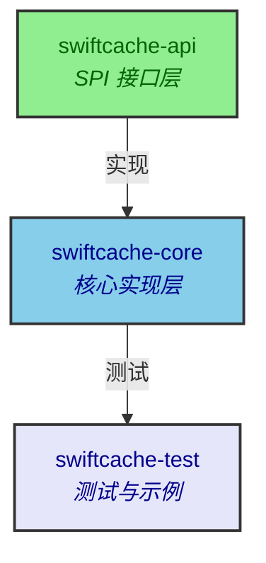
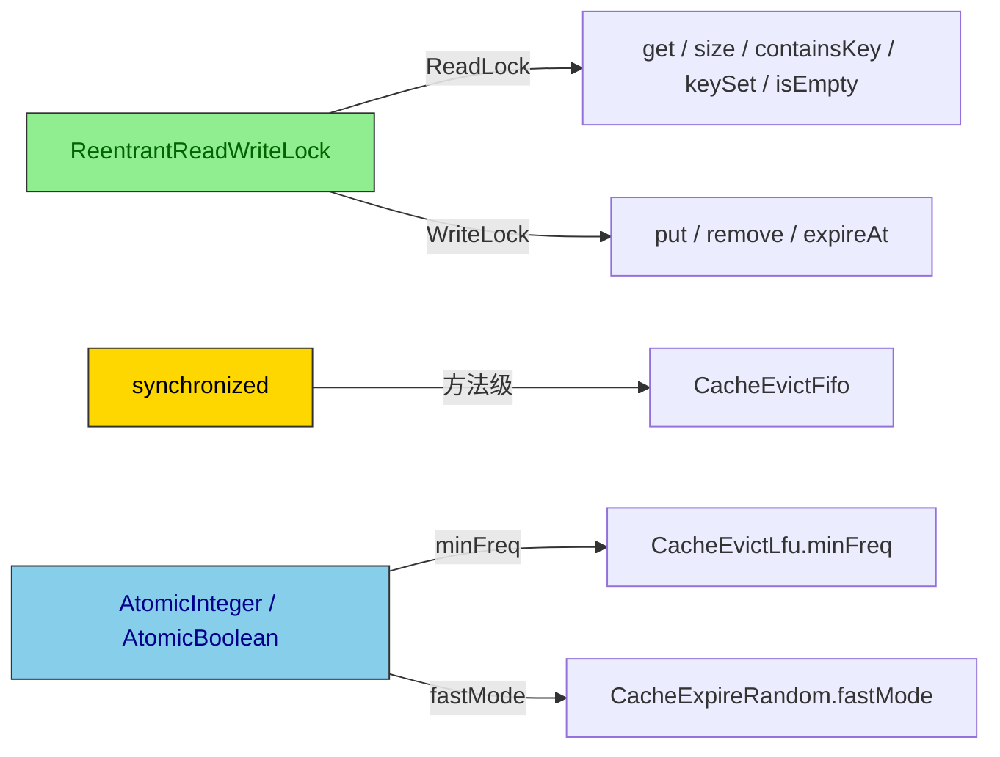

<div align="center">

# SwiftCache

**轻量级模块化的本地 Java 缓存库**

[](#)
[](https://github.com/zhentaozhang/swiftcache/actions/workflows/maven.yml)

[概述](#概述) • [快速开始](#快速开始) • [淘汰策略](#淘汰策略) • [过期策略](#过期策略) • [持久化](#持久化) • [架构](#架构) • [基准测试](#基准测试)

</div>

## 概述

**SwiftCache** 是一个面向 Java 17 的模块化本地缓存库，支持 8 种淘汰策略、4 种过期策略、AOF/RDB 持久化、可插拔拦截器链和事件监听。与 `ConcurrentHashMap` 不同，它在缓存语义层面内置了淘汰触发、过期扫描和持久化能力，无需自行组合多个组件。

**核心特性：**

- **8 种淘汰策略** — FIFO、LRU、LFU、Clock、LRU-2、LRU-2Q、双链表 LRU、无淘汰
- **4 种过期策略** — Redis 式随机采样、排序过期、顺序过期、无过期
- **AOF/RDB 持久化** — 实时追加日志与定时全量快照，支持重启恢复
- **`CacheBs` Builder** — Fluent API，一行组装缓存实例
- **拦截器链** — 可插拔 before/after 钩子：耗时统计、淘汰触发、AOF 记录、惰性刷新、统计采集
- **事件监听** — `CacheListener` SPI，支持 `PUT` / `REMOVE` / `EXPIRE` / `EVICT`
- **运行时指标** — 命中/未命中/淘汰/写入计数 + 命中率
- **线程安全** — `ReentrantReadWriteLock` 读写锁 + `AtomicInteger`/`AtomicBoolean` 原子状态

## 快速开始

```xml
<dependency>
  <groupId>io.swiftcache</groupId>
  <artifactId>swiftcache-core</artifactId>
  <version>1.0.1</version>
</dependency>
```

需 Java 17+ 和 Maven：

```bash
git clone https://github.com/zhentaozhang/swiftcache.git
cd swiftcache
mvn package
```

### 基础用法

```java
Cache<String, String> cache = CacheBs.<String, String>newInstance()
        .size(3)
        .build();

cache.put("A", "hello");
cache.put("B", "world");
cache.put("C", "foo");
cache.get("A");                  // "hello"
cache.size();                    // 3

cache.put("D", "bar");           // 触发淘汰（默认 FIFO）
cache.containsKey("A");          // false
```

完整示例见 [`CacheDemo.java`](swiftcache-test/src/test/java/io/swiftcache/core/demo/CacheDemo.java)。

### Builder 配置

```java
Cache<String, String> cache = CacheBs.<String, String>newInstance()
        .size(100)
        .evict(CacheEvicts.<String, String>lfu())
        .expire(CacheExpires.<String, String>random())
        .persist(CachePersists.<String, String>dbJson("cache.rdb"))
        .load(CacheLoads.<String, String>dbJson("cache.rdb"))
        .listener(event -> System.out.println(event.type() + " " + event.key()))
        .build();
```

> [!TIP]
> 未配置的组件均使用默认策略（FIFO 淘汰 + 随机过期 + 无持久化）。

## 淘汰策略

通过 `CacheBs.evict()` 配置，使用 `CacheEvicts` 工厂创建：

```java
Cache<String, String> cache = CacheBs.<String, String>newInstance()
        .evict(CacheEvicts.<String, String>lfu())
        .build();
```

| 工厂方法 | 策略 | 说明 |
|----------|------|------|
| `fifo()` | FIFO | 先进先出，基于 `LinkedHashSet` |
| `lru()` | LRU | 最近最少使用，`LinkedHashMap` access-order |
| `lfu()` | LFU | 最不经常使用，频率 map + 最小频率追踪 |
| `clock()` | Clock | 第二次机会时钟算法，循环链表 |
| `lru2()` | LRU-2 | 频率感知变体 |
| `lru2Q()` | LRU-2Q | 双队列变体，命中率更高 |
| `lruDoubleListMap()` | 双链表 LRU | HashMap + 双向链表 |
| `none()` | 无淘汰 | 永不淘汰 |

## 过期策略

通过 `CacheBs.expire()` 配置，使用 `CacheExpires` 工厂创建：

```java
Cache<String, String> cache = CacheBs.<String, String>newInstance()
        .expire(CacheExpires.<String, String>sort())
        .build();
```

| 工厂方法 | 策略 | 行为 |
|----------|------|------|
| `random()` | 随机采样 | Redis 式随机采样 + 惰性删除 + 定时扫描，支持快模式 |
| `sort()` | 排序过期 | `TreeMap` 有序过期队列，确定性强 |
| `sequence()` | 顺序过期 | 按迭代顺序遍历扫描 |
| `none()` | 无过期 | 永不过期 |

过期线程池为命名守护线程（`cache-expire-*`），JVM 退出时自动清理。

> [!TIP]
> `random()` 策略在大量 key 的场景下吞吐更稳定；`sort()` 策略过期精度更高、延迟更可预测。

## 持久化

```java
// RDB 快照，每 5 分钟全量持久化
Cache<String, String> cache = CacheBs.<String, String>newInstance()
        .persist(CachePersists.<String, String>dbJson("cache.rdb"))
        .load(CacheLoads.<String, String>dbJson("cache.rdb"))
        .build();

// AOF 追加日志，每 1 秒持久化
Cache<String, String> cache2 = CacheBs.<String, String>newInstance()
        .persist(CachePersists.<String, String>aof("cache.aof"))
        .load(CacheLoads.<String, String>aof("cache.aof"))
        .build();
```

| 策略 | 机制 | 适用场景 |
|------|------|----------|
| **RDB** | 定时全量 JSON 快照 | 写入频率低、需定点恢复 |
| **AOF** | 实时追加每条写操作日志 | 写入频繁、需高持久性 |
| **无** | 不持久化 | 纯缓存场景 |

RDB 支持自定义调度周期：

```java
// 每 30 秒全量快照
CachePersists.<String, String>dbJson("cache.rdb", 30, TimeUnit.SECONDS)
```

持久化线程池为命名守护线程（`cache-persist-*`），JVM 退出时自动清理。

## 事件监听

```java
List<CacheEvent<String, String>> events = new ArrayList<>();

Cache<String, String> cache = CacheBs.<String, String>newInstance()
        .listener(events::add)
        .build();

cache.put("A", "1");     // PUT
cache.remove("A");       // REMOVE
```

支持的事件类型：`PUT`、`REMOVE`、`EXPIRE`、`EVICT`。

## 缓存统计

```java
Cache<String, String> cache = CacheBs.<String, String>newInstance().build();
cache.put("A", "1");
cache.get("A");              // 命中
cache.get("MISS");           // 未命中

CacheStats stats = cache.cacheContext().stats();
stats.hitCount();            // 1
stats.missCount();           // 1
stats.putCount();            // 1
stats.hitRate();             // 0.5
```

## 架构

### 模块结构

SwiftCache 采用三模块分层设计：



### 包结构

| 包 | 职责 |
|---|---|
| `api` | `Cache` 核心接口、`CacheEntry`、`CacheContext` |
| `api/evict` | `CacheEvict` — 淘汰策略 SPI |
| `api/expire` | `CacheExpire` — 过期策略 SPI |
| `api/interceptor` | `CacheInterceptor` + 拦截器上下文 |
| `api/listener` | `CacheListener` + `CacheEvent` / `CacheEventType` |
| `api/load` | `CacheLoad` — 数据加载 SPI |
| `api/persist` | `CachePersist` — 持久化 SPI |
| `api/serializer` | `CacheSerializer` — 序列化接口 |
| `api/stats` | `CacheStats` — 统计接口 |
| `core/bs` | `CacheBs` — Fluent Builder |
| `core/core` | `DefaultCache` + `DefaultCacheContext` |
| `core/model` | 数据模型（`FreqNode`、`CircleListNode`、`PersistRdbEntry` 等） |
| `core/support/evict` | 8 种淘汰策略实现 |
| `core/support/expire` | 4 种过期策略实现 |
| `core/support/interceptor` | 拦截器链 + 6 个内置拦截器 |
| `core/support/load` | AOF/RDB/空 加载器 |
| `core/support/persist` | AOF/RDB/空 持久化实现 |
| `core/support/serializer` | `JacksonSerializer` |
| `core/support/struct` | LRU 数据结构（循环链表、双链表） |

### 拦截器链

每次缓存操作沿拦截器链依次经过 before → 核心操作 → after 三个阶段：

```mermaid
flowchart LR
    CALL["Cache.put(key,value)"]
    BEFORE["1️⃣ CacheInterceptorCommonCost.before"]
    EVICT_BEFORE["2️⃣ CacheInterceptorEvict.before"]
    OPERATION["📦 cacheMap.put(key,value)"]
    EVICT_AFTER["3️⃣ EvictTrackingInterceptor.after"]
    AOF["4️⃣ CacheInterceptorAof.after"]
    REFRESH["5️⃣ CacheInterceptorRefresh.after"]
    STATS["6️⃣ StatsInterceptor.after"]
    COST_AFTER["1️⃣ CacheInterceptorCommonCost.after"]
    DONE["✅ done"]

    CALL --> BEFORE
    BEFORE --> EVICT_BEFORE
    EVICT_BEFORE --> OPERATION
    OPERATION --> EVICT_AFTER
    EVICT_AFTER --> AOF
    AOF --> REFRESH
    REFRESH --> STATS
    STATS --> COST_AFTER
    COST_AFTER --> DONE

    classDef interceptor fill:#FFD700,stroke:#333,stroke-width:1px,color:black
    classDef core fill:#87CEEB,stroke:#333,stroke-width:2px,color:darkblue

    class BEFORE,EVICT_BEFORE,EVICT_AFTER,AOF,REFRESH,STATS,COST_AFTER interceptor
    class CALL,OPERATION core
```



| 顺序 | 拦截器 | 阶段 | 职责 |
|------|--------|------|------|
| 1 | `CacheInterceptorCommonCost` | before + after | 方法和入参日志、执行耗时统计 |
| 2 | `CacheInterceptorEvict` | before | `put` 前触发淘汰 |
| 3 | `EvictTrackingInterceptor` | after | 更新淘汰策略的访问记录 |
| 4 | `CacheInterceptorAof` | after | 写操作追加到 AOF 缓冲区 |
| 5 | `CacheInterceptorRefresh` | after | 惰性过期刷新 |
| 6 | `StatsInterceptor` | after | 采集命中/未命中/写入统计 |

### 线程安全



## 基准测试

JMH 吞吐量基准测试结果（JDK 23.0.2，10 CPUs）：

```
Benchmark                        Mode  Cnt         Score          Units
put-100K                        thrpt    2   3,764,830        ops/s
get-hit-100K                    thrpt    2   5,259,421        ops/s
evict-lfu                       thrpt    2   2,927,529        ops/s
expire-sort                     thrpt    2   1,543,994        ops/s
aof-100K                        thrpt    2   3,070,707        ops/s
concurrent-write-4t             thrpt    2   2,296,030        ops/s
rdb-100K                         thrpt    2      31             ms
```

本地复现基准测试：

```bash
mvn test -pl swiftcache-test -Dtest=CacheBenchmark -q
```

### 技术栈

| 类别 | 组件 |
|------|------|
| **语言** | Java 17 |
| **构建** | Maven 3.x |
| **JSON** | Jackson 2.15 |
| **日志** | SLF4J 2.0 + Logback 1.4 |
| **测试** | JUnit 5.10 + AssertJ 3.24 |
